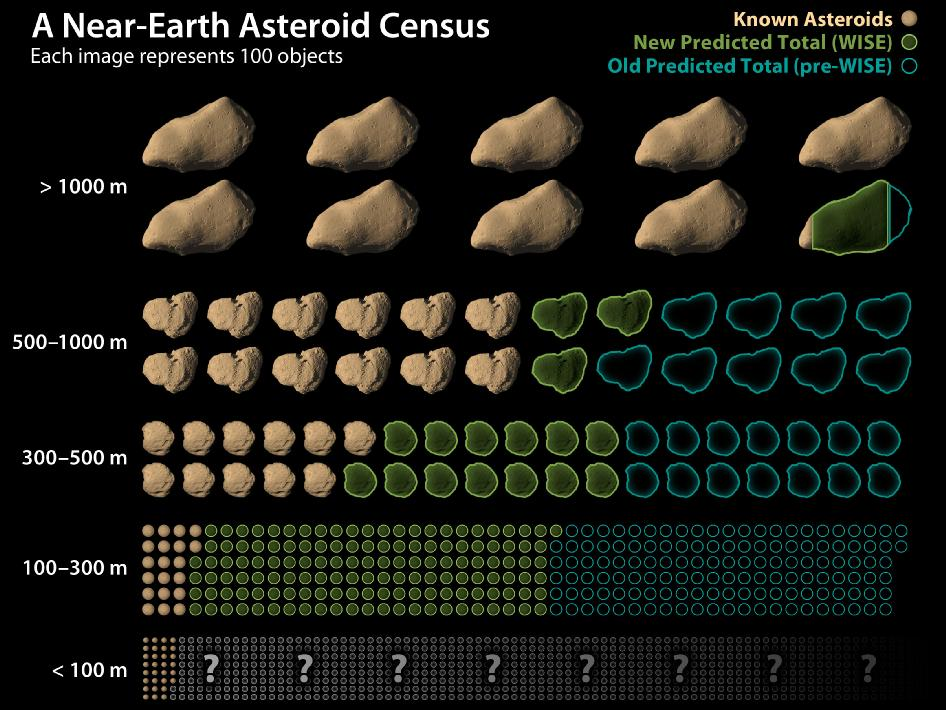
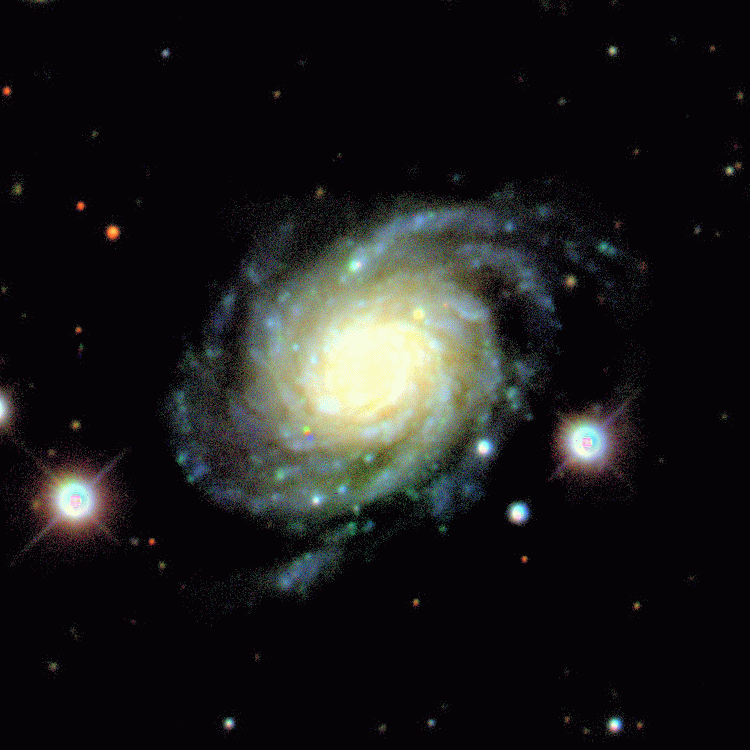

## Rocky Rockets {data-background-image="../images/Summer_Triangle.jpg"}

<video data-autoplay loop src="../video/Fireballs/D6_FB1.mp4" width="75%"></video>

## Mission: Find the Big Ones
::::::cols
::::col
- In 1998, NASA tasked with finding 90% of asteroids 1 km or larger
	- It is thought that we have met this now
- In 2005, NASA tasked with finding 90% of "dangerous" asteroids by 2020
	- Current estimates are than around 10% have been found
- How are these goals met without knowing how many are out there?
::::

::::col

:::r-stack
<video class="fragment fade-out" data-fragment-index="0" controls loop src="../video/Chelyabinsk_NoAudio.webm" width="100%"></video>

{class="fragment fade-in" data-fragment-index="0"}

:::

::::
::::::

## Mission: Collision P's
 

::::::cols
::::col

:::r-stack
{width=70% class="fragment fade-out" data-fragment-index="0"}

<video class="fragment fade-in" data-fragment-index="0" controls loop src="../video/LRO_Bonk.mp4" width="100%"></video>
:::
::::

::::col
- Protection, Prevention, Prediction
- Better knowledge of meteoroid sizes leads to better protection
- If nothing else, allows to predict the lifetime of spacecraft before statistically getting struck

> "Construct of X size will likely last Y years before being hit by a rock of size Z or larger."
::::
::::::

## Mission: Science!
 

- The number and sizes of the meteoroid population can give insight into the history of the Solar System
- A few options when rocks collide:
	- They could merge, making a larger rock
	- They smash one another apart, making more smaller rocks
	- Easy to replicate on a small scale by smashing...anything!
- The populations we observe can inform things like how old, dense, or energetic the Solar System has been in the past

## Observe: Movement
 

::::::cols
::::col
{width=100%}
::::

::::{.col style="flex-grow:2"}
{width=100%}
::::
::::::

## Observe: Moon Smashing
  

::::::cols
::::col
- Many impacts too small to be directly observed
- Can only see them when they interact with something
- The Moon has no atmosphere, and thus meteoroids are free to smash into the surface, emitting a flash!
::::

::::col
<video data-autoplay loop src="../video/LunarImpact_NoAudio.webm" width="100%"></video>
::::
::::::

## Observe: Earth Smashing
- Can also observe meteoroids directly burning up in our atmosphere!

::::::cols
::::col
<video controls data-autoplay loop src="../video/Fireballs/D6_FB1.mp4" width="100%"></video>
<video controls data-autoplay loop src="../video/Fireballs/D6_FB2.mp4" width="100%"></video>

::::
::::col
<video controls data-autoplay loop src="../video/Fireballs/D6_FB3.mp4" width="100%"></video>
<video controls data-autoplay loop src="../video/Fireballs/D6_FB4.mp4" width="100%"></video>

::::

::::col
<video controls data-autoplay loop src="../video/Fireballs/D6_FB5.mp4" width="100%"></video>
<video controls data-autoplay loop src="../video/Fireballs/D6_FB6.mp4" width="100%"></video>

::::
::::::

## Not Meteors!
 

::::::cols
::::col
<figure>
<video data-autoplay controls loop src="../video/Fireballs/D6_Lightning.mp4" width="100%"></video>
<figcaption>Lightning is annoying</figcaption>
</figure>
::::

::::col
<figure>
<video data-autoplay controls loop src="../video/Fireballs/D6_Spider.mp4" width="100%"></video>
<figcaption>Pesky spiders...</figcaption>
</figure>
::::
::::::

## Why I Enjoy: Nights {data-background-image='../images/NightSky.jpg'}
 

::::::cols
::::col
- I enjoy night-time observing
- Peaceful
- Feeling of be productive while the world sleeps
- Can practice some astrophotography
::::

::::col
{width=60%}
::::
::::::

## Why I Enjoy: Flexibility
 

::::::cols
::::col

- Does not require elaborate setup or lab
- Fairly cheap
- Can be easily moved
- Software all open source and my own

::::

::::col

::::
::::::

## Why I Enjoy: Social Impact
 

- It is satisfying to work on something which is easy to see benefiting society
	- Either helping to identify or strategize about potentially hazardous asteroids
	- Or making future space travel and living a bit safer and feasible
- It is easy to describe and explain to non-scientists

## Conclusions
 

- Extra benefits of this research
	- Small engineering projects pop up enough to keep life interesting
	- Lots of Python programming practice for data processing and analysis
	- Experience using Linux systems, and remote accessing terminal based systems
- If you'd like to hear more and chat, don't hesitate to ask!
	- I'm not in my office as much as usual this semester, but am almost always in Discord or happy to chat via Zoom!

## Credits
- Asteroid background: [Youtube](https://www.youtube.com/watch?v=XWts8cwvYuE)
- Chelyabinsk dashcam footage: [Youtube](https://www.youtube.com/watch?v=LuCa2Y86iq4)
- Hypervelocity image image: [ESA](https://www.esa.int/Safety_Security/Space_Debris/Hypervelocity_impacts_and_protecting_spacecraft)
- LRO Plonk: [Alex Parker Twitter](https://twitter.com/Alex_Parker/status/868206540486057986)
- Colorful Milky Way: [Andy Holmes on Unsplash](https://unsplash.com/photos/rCbdp8VCYhQ)
- Asteroid Gaia Gif: [Observatoire de Haute-Provence & IMCCE](https://phys.org/news/2017-01-gaia-eyes-asteroid.html)
- Asteroid in Galaxy: [SDSS Skyserver](http://skyserver.sdss.org/dr1/en/proj/basic/asteroids/howtofind2.asp)
- Asteroids Found Chart: [NASA/JPL-Caltech](https://www.nasa.gov/mission_pages/WISE/multimedia/gallery/neowise/pia14734.html)
- Lunar Impact: [Youtube](https://www.youtube.com/watch?v=42d1jSTSfWI)
